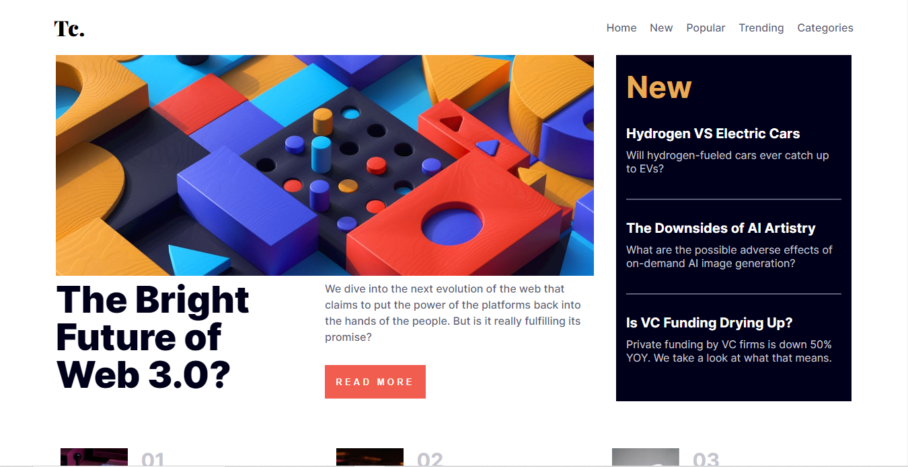
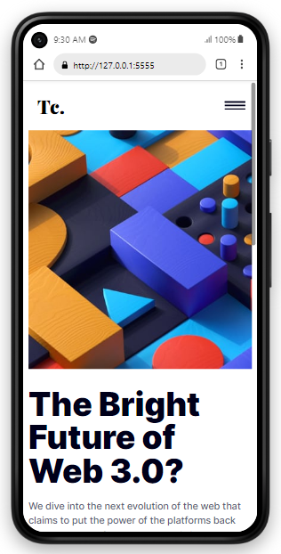

# Frontend Mentor - News homepage solution

This is a solution to the [News homepage challenge on Frontend Mentor](https://www.frontendmentor.io/challenges/news-homepage-H6SWTa1MFl). Frontend Mentor challenges help you improve your coding skills by building realistic projects. 

## Table of contents

- [Frontend Mentor - News homepage solution](#frontend-mentor---news-homepage-solution)
  - [Table of contents](#table-of-contents)
  - [Overview](#overview)
    - [The challenge](#the-challenge)
    - [Screenshot](#screenshot)
    - [Links](#links)
  - [My process](#my-process)
    - [Built with](#built-with)
    - [What I learned](#what-i-learned)
    - [Continued development](#continued-development)
    - [Useful resources](#useful-resources)
  - [Author](#author)

## Overview

### The challenge

Users should be able to:

- View the optimal layout for the interface depending on their device's screen size
- See hover and focus states for all interactive elements on the page

### Screenshot

### Links

- Solution URL: [Github](https://github.com/Techa-News)
- Live Site URL: [Techa News](https://techanews.netlify.app)

## My process

### Built with

- Semantic HTML5 markup
- SASS preprocessor
- Flexbox
- CSS Grid
- Desktop-first workflow
- Vanilla JS library
- [SCSS](https://scss.com/) - For styles

### What I learned

It's been a while I worked on web projects, this was more of a memory refresh for me.

### Continued development

Would look into prospects and see to an extension of fuunctionality and probably full multipaged project, would definitely migrate to react or next to do that.

`Let's Just See How It Goes`

### Useful resources

`To be updated...`

## Author

- Website - [Add your name here](#)
- Frontend Mentor - [@yourusername](https://www.frontendmentor.io/profile/Mire-web)
- Twitter - [@not_ifeanyi](https://www.twitter.com/not_ifeanyi)